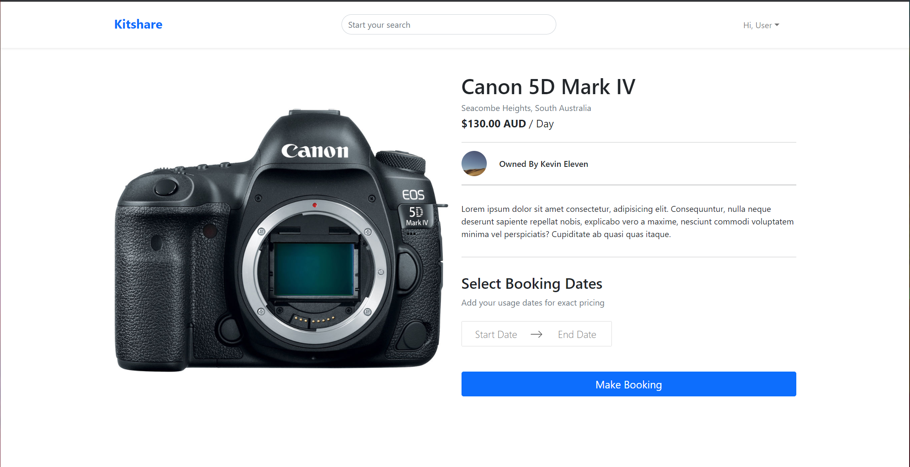

# KitShare - An Equipment Leasing Platform for the Modern Age


<p align="center">
  
</p>
<p align="center">

  <p align="center">
    <br />
    <a href="https://kitshare-app.herokuapp.com/">Live Demo</a>
  </p>
</p>

<!-- TABLE OF CONTENTS -->
<details open="open">
  <summary>Table of Contents</summary>
  <ol>
    <li>
      <a href="#overview">Overview</a>
      <ul>
        <li><a href="#technologies-used">Technologies Used</a></li>
        <li><a href="#acceptance-criteria">Acceptance Criteria</a></li>
      </ul>
    </li>
    <li>
      <a href="#getting-started">Getting Started</a>
      <ul>
        <li><a href="#prerequisites">Prerequisites</a></li>
        <li><a href="#installation">Installation</a></li>
      </ul>
    </li>
    <li><a href="#future-improvements">Future Improvements</a></li>
    <li><a href="#license">License</a></li>
  </ol>
</details>
<br>

## Overview

KitShare is an equipment rental platform that empowers creative professionals by allowing them to lease out their camera equipment while not in use and providing them with a large inventory of equipment to choose and hire from.

### Technologies Used

KitShare currently uses the following technologies:

- [React.js](https://reactjs.org/)
- [react-dates](https://github.com/airbnb/react-dates)
- [Axios](https://github.com/axios/axios)
- [Bootstrap](https://getbootstrap.com/)
- [Node.js](https://nodejs.org/en/)
- [Express.js](https://expressjs.com/)
- [SuperTest](https://github.com/visionmedia/supertest#readme)
- [Jest](https://jestjs.io/)
- [Bcrypt](https://github.com/kelektiv/node.bcrypt.js#readme)
- [Sequelize](http://sequelize.org/)
- [MysQL](https://www.mysql.com/)

## Getting Started

To get a local copy of this project up and running follow these simple steps.

### Prerequisites

First you must install [Node.js](https://nodejs.org/en/) and [NPM](https://www.npmjs.com/get-npm) if you haven't done so already. Once this is done, follow the installation instructions below to run the application locally.

### Installation

1. Clone the repository.
   ```sh
   git clone https://github.com/kevin-aminzadeh/kitshare.git
   ```
2. Navigate to the repository directory and run the following command to install the necessary NPM packages.
   ```sh
   npm install
   ```
3. Run the app start script.
   ```sh
   npm start
   ```

## Future Improvements

KitShare is currently in its infancy and still under development, as such, there are plenty of available avenues for improvement.

Some noteworthy improvements which could be made include:

- Implementing user authentication/authorization and to allow true usability of the application.
- Further decomposing React.js components to improve component reusability and code readability.
- Implementation of a complete unit testing suite to aid development efforts.
- Completion of Stripe.js integration for payment processing
- Completion of DVS integration for ID verification
- Creating a richer UI experience by moving away from Bootstrap and creating UI components from the ground up.
- Implementing data analytics to provide useful insights to `sellers` on the platform.

## License

This project is licensed under the terms of the [MIT license](https://opensource.org/licenses/MIT).
